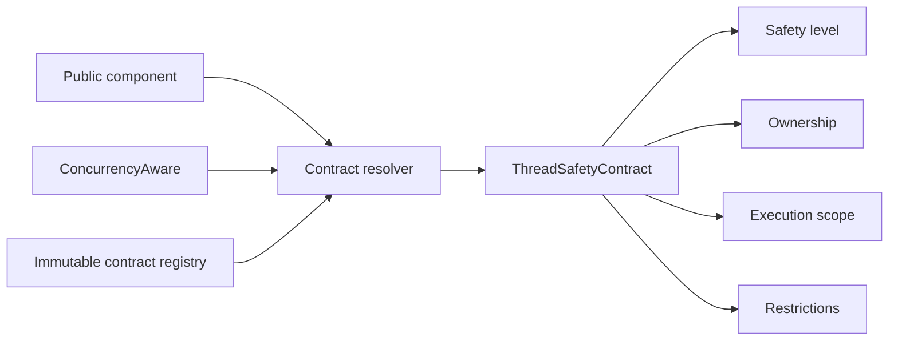

# Concurrency Contracts

## Contract Model

`epip.core.concurrency` is the authoritative machine-readable concurrency catalog. A contract
contains:

- component qualified name;
- thread-safety level;
- ownership model;
- execution scope;
- supported capabilities;
- reentrance declaration;
- determinism under concurrency;
- mandatory restrictions.

## Safety Levels

| Level | Guarantee |
| --- | --- |
| Thread Safe | Documented concurrent operations preserve internal structural integrity. |
| Thread Compatible | Safe only when callers serialize mutation of a shared instance. |
| Thread Confined | One thread or run owns the instance and its mutable dependencies. |
| Non Thread Safe | Concurrent use is unsupported even with ordinary caller assumptions. |

## Resolution

`concurrency_contract_for()` accepts an instance, type, or fully qualified component name. Native
`ConcurrencyAware` declarations take precedence for instances. Existing EPIP components resolve
through the immutable central registry to avoid runtime modification and import cycles.

Contracts are architectural metadata. They do not acquire locks, serialize calls, intercept
methods, or imply distributed safety.
