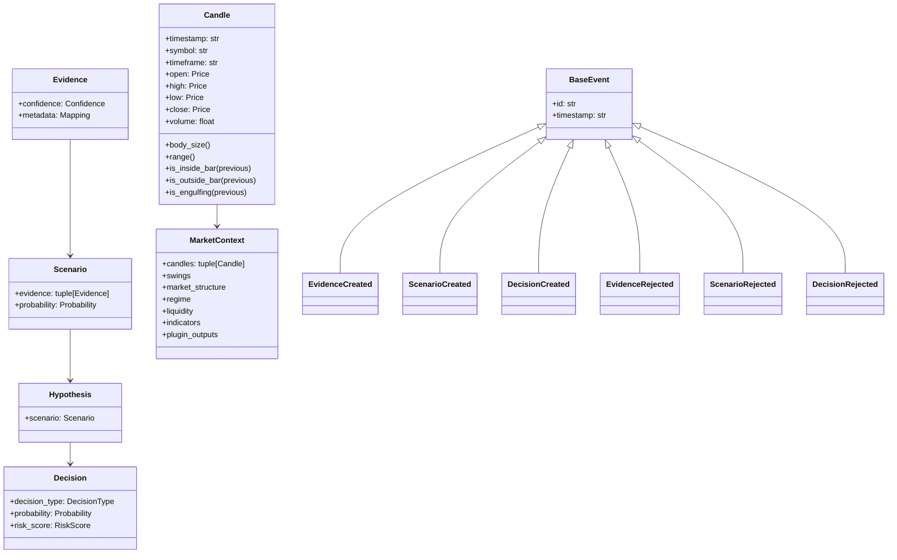

# Core Domain Architecture

## Overview

The core domain hosts the immutable value objects and domain rules for candles, evidence, scenarios, hypotheses, decisions, market context, and the core events emitted by the system.

## Responsibilities

- Preserve the business semantics of the trading domain without external dependencies.
- Validate domain invariants at construction time.
- Provide immutable state and serialization helpers for persistence and messaging.
- Define domain events and contracts that remain decoupled from infrastructure concerns.

## UML

## Dependencies

The core domain depends only on:

- standard library modules such as `dataclasses`, `datetime`, `json`, `uuid`, and `typing`
- the shared domain enums from [epip/core/types.py](../core/types.py)

## Execution Flow

1. A market context is created from one or more candles.
2. Evidence producers emit evidence from the context.
3. Scenarios are built from evidence and validated.
4. Hypotheses are derived from the scenarios.
5. Decisions are emitted with probability and risk metadata.
6. Domain events are raised for accepted or rejected outcomes.
