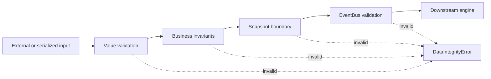

# Data Integrity Architecture

## Boundary Model

EPIP validates data at four layers:

1. Value objects reject invalid scalar domains.
2. Business objects validate local and relational invariants during construction.
3. Serialization adapters reject missing, malformed, or incompatible payloads.
4. EventBus validates payloads before storing or dispatching them.

## Invariant Categories

- Identity: required, non-empty and unique identifiers.
- Numeric: finite numbers, explicit sign rules and documented ranges.
- Version: positive integer schema and snapshot versions.
- Relationship: consistent symbols, timeframes, parent IDs and aggregate quantities.
- Immutability: frozen, slotted dataclasses and immutable tuple collections.
- Serialization: dedicated translation of malformed payload failures.

## Engine Contract

An engine may assume that an accepted snapshot has passed its constructor invariants. Engines retain
their existing domain-specific input validators, and output construction performs a second check.
This creates validation on both sides of every public engine boundary without recomputing analysis.

The shared engine-boundary decorator validates immutable inputs and outputs. EventBus requires the
explicit integrity protocol, preventing arbitrary objects from entering event history. Metadata and
arbitrary feature payloads are recursively copied and frozen to prevent aliasing.
