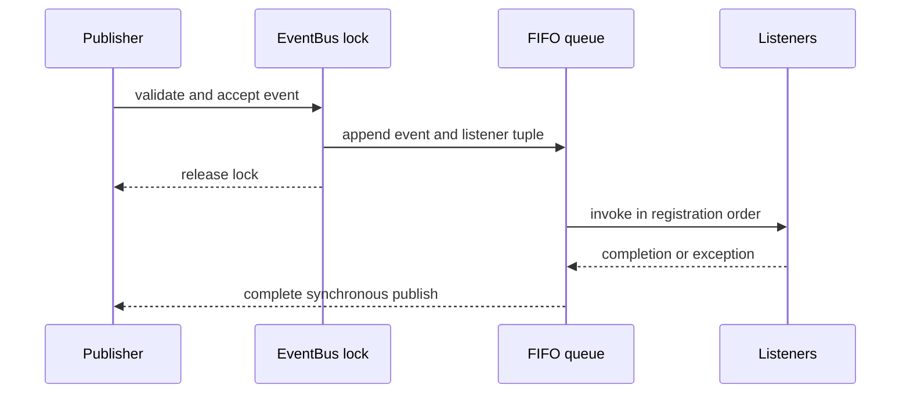

# EventBus Concurrency

## Publication Lifecycle

No listener executes while the EventBus lock is held. Engines must also release their state lock
before calling `publish()` or `publish_many()`.

## FIFO Guarantee

The queue order is the order in which publications acquire the EventBus lock and are accepted.
History uses the same acceptance order. Only one dispatcher invokes listeners, so callback streams
cannot overtake each other.

## Concurrent Publishers

The first publisher becomes dispatcher. Other publisher threads append their immutable publication
record and wait without holding the EventBus lock. Each returns after its own listener delivery has
completed or raises its own listener error.

The only exception is a publisher arriving from another thread while a listener callback is active.
It returns after FIFO acceptance. This prevents the active listener from deadlocking if it joins
that publisher thread. The dispatcher delivers the accepted event after the current snapshot.

## Recursive Publication

A listener may publish recursively. The nested event is appended to the queue and the nested call
returns after acceptance to avoid self-deadlock. It is delivered after all listeners of the current
event. A per-dispatch limit prevents infinite recursive generation.

## Listener Failures

An exception stops the remaining listeners for that publication, preserving historical behavior.
The dispatcher records the error, completes queued publications, and then propagates the first
failure to the originating dispatch call. Subsequent independent publications remain operational.
The boundary includes every `BaseException`; dispatcher flags and pending waiters are restored even
if an unexpected failure escapes internal dispatch processing.

## Snapshot Semantics

Listeners are copied into a tuple at acceptance. `subscribe()`, `unsubscribe()`, and `clear()` may
run during delivery but affect only future accepted publications.
