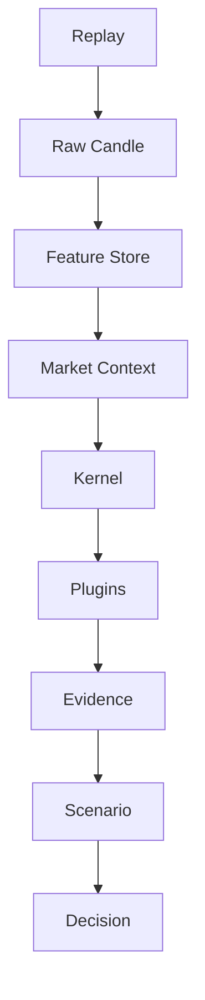
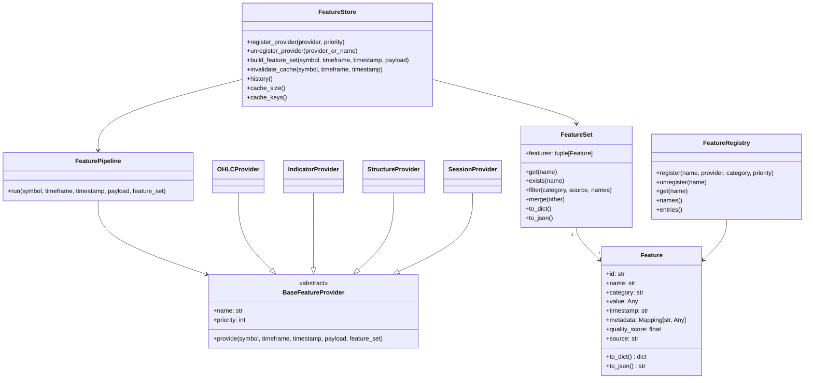

# Feature Store Architecture (EPIP-003)

## Purpose
The Feature Store is the single source of enriched market data used by analysis layers.
It receives raw candle payloads and produces immutable feature collections.

## Position in the Flow

## Main Components

## Pipeline Behavior
1. A raw candle payload enters the Feature Store.
2. The store resolves `(symbol, timeframe, timestamp)` cache key.
3. On cache miss, providers run in deterministic priority order.
4. Each provider emits features and enriches the current FeatureSet.
5. The resulting immutable FeatureSet is cached and recorded in history.

## Responsibilities
- Feature: immutable atomic enriched value.
- FeatureSet: immutable aggregate for one candle.
- FeatureStore: provider orchestration, cache, history, thread safety.
- FeatureRegistry: metadata ownership and discovery for available features.
- Providers: isolated production units; each provider only depends on input payload and current feature set.

## Dependency Boundaries
- Feature Store is independent of Kernel, Plugin implementations, Elliott/ICT/Wyckoff strategies, and data vendors.
- Providers are isolated from each other.
- Plugins consume FeatureSet output but never call providers directly.

## Thread Safety and Cache
- FeatureStore uses an `RLock` to protect provider registration, cache mutations, and history.
- Cache key: `(symbol, timeframe, timestamp)`.
- Cache invalidation supports full clear or partial key-based purge.

## Logging
- Feature Store uses standard `logging` for cache hit traces and runtime observability.
