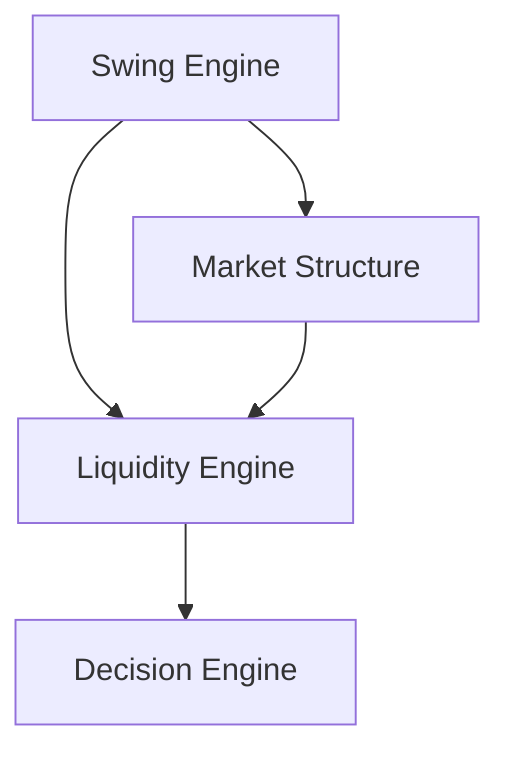

# Liquidity Engine Architecture (EPIP-008)

## Purpose

The Liquidity Engine is EPIP's single official source of liquidity information. Downstream
Fibonacci, Elliott, Decision, Risk, and Execution modules consume immutable liquidity snapshots and
must not recalculate liquidity.

## Architecture

The package depends only on Core/EventBus, Swing, and Market Structure. `LiquidityEngine` validates
matching streams, delegates pure detection to `LiquidityAnalyzer`, stores per-stream graph and
history, publishes domain events, and records metrics under `RLock` protection.

## Algorithms

Equal-level detection clusters same-polarity pivots inside `equal_threshold`. Clusters meeting
`minimum_touches` become buy-side or sell-side pools. A later confirmed pivot beyond a pool plus
`minimum_distance` produces a sweep and stop-hunt observation. Swing scope identifies internal and
external liquidity. Zones surround resting pool prices; gaps between levels remain available for
future void enrichment.

## Graph and History

`LiquidityGraph` provides immutable previous/next and parent/child navigation, with every node
linked to its originating market-structure version. `LiquidityHistory` uses copy-on-append,
monotonic versions, timestamp/version lookup, deterministic serialization, and replay iteration.

## Events and Snapshots

The engine publishes `LiquidityDetected`, `LiquidityPoolCreated`, `LiquiditySweepDetected`,
`EqualHighDetected`, and `EqualLowDetected`. Lifecycle contracts also include
`LiquidityConsumed` and `LiquidityInvalidated`. `LiquiditySnapshot` is immutable, versioned,
serializable, and isolated per symbol/timeframe.

## Production Framework Extensions

Liquidity lifecycle is governed by an explicit state machine from `CREATED` through active,
partial-consumption, consumption, or invalidation states. `LiquidityStrength` combines touches,
age, reactions, consumption and confidence into deterministic five-tier `LiquidityRanking`.
Fair-value gaps, bullish/bearish specializations, liquidity voids, and heterogeneous clusters are
immutable extension objects. A multi-timeframe tree enforces parent-child direction across M1, M5,
M15, H1, H4 and D1. All objects expose bounded confluence scores and deterministic serialization.
Metrics include consumption, lifetime and average-confluence extension fields.
