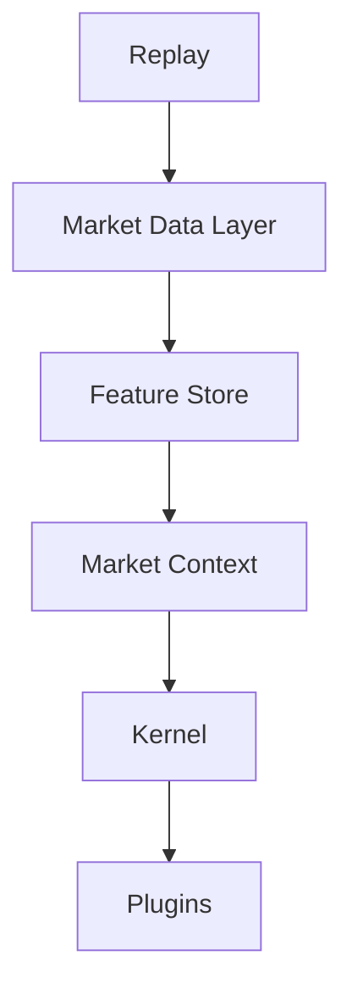
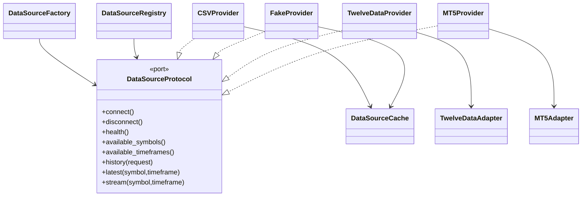
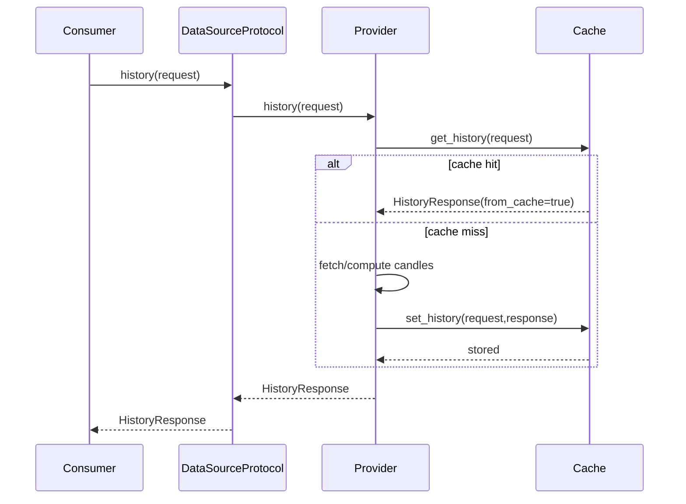

# Market Data Layer Architecture (EPIP-004)

## Purpose

The Market Data Layer is the single ingress point for market data across EPIP.
No downstream module should directly use CSV, TwelveData, MT5, or any external vendor SDK.

## Layer Position

## Ports & Adapters

## Sequence (History Request)

## Responsibilities

- DataSourceProtocol: stable ingress contract.
- DataSourceFactory: centralized provider construction from config.
- DataSourceRegistry: runtime provider registration and default resolution.
- DataSourceCache: thread-safe LRU + TTL for history/latest.
- Providers:
  - CSV: complete parsing and pagination.
  - Fake: deterministic test/benchmark provider.
  - TwelveData: adapter-based interface-only provider.
  - MT5: adapter-based architecture-only provider.

## Thread Safety

- Provider lifecycle and cache access are guarded by `RLock`.
- Cache structures are protected and mutated under lock.
- Registry operations are lock-protected.

## Dependency Rules

- Replay, Feature Store, Context, Kernel, and Plugins must depend on `DataSourceProtocol` only.
- Provider-specific concerns remain encapsulated behind this layer.
