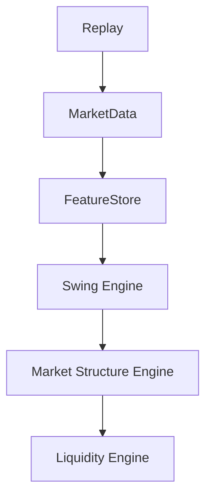
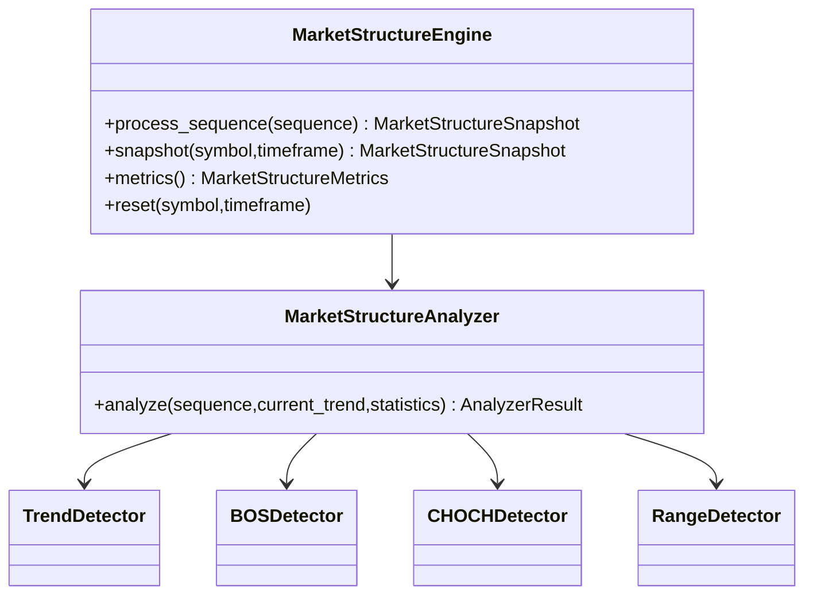
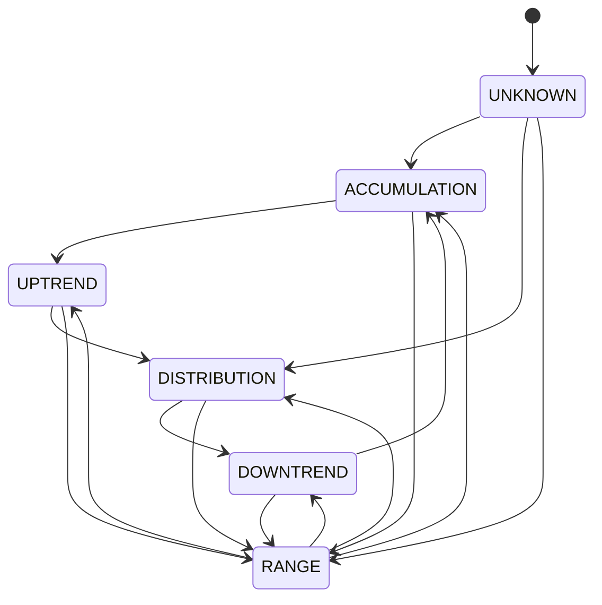
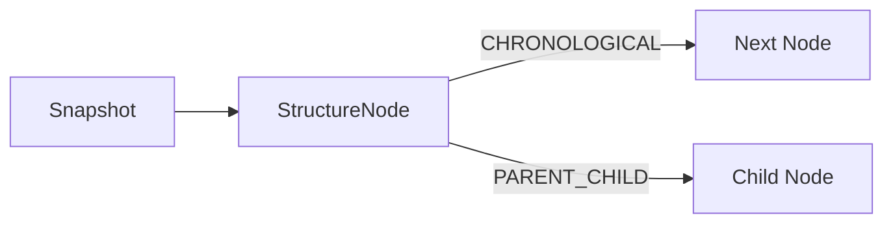

# Market Structure Engine Architecture (EPIP-007)

## Purpose

Market Structure Engine is the single official source for trend, BOS, CHOCH, and ranging state.
All downstream modules must consume this engine and must not recompute structure independently.

## Dependency Rule

Market Structure depends only on Swing outputs (`SwingSequence`).
It does not access Replay, MarketData, FeatureStore, CSV, MT5, or TwelveData.

## Flow

## Components

## Algorithms

- TrendDetector infers trend from latest swing classifications.
- BOSDetector detects bullish/bearish structure breaks and suppresses duplicates.
- CHOCHDetector detects first trend reversal transition and suppresses duplicates.
- RangeDetector identifies sideways regimes through repeated equal/high-low touches.

## Detector Protocol

- All detectors implement `StructureDetectorProtocol`.
- This keeps the engine closed for modification and open for extension (future Liquidity/ICT/Wyckoff detectors).

## Determinism

Given the same SwingSequence and config, the engine emits the same structure snapshot and events.

## State Machine

Illegal transitions raise `IllegalStructureTransitionError`.

## Events

- StructureDetected
- BOSDetected
- CHOCHDetected
- TrendChanged
- RangeDetected
- StructureReset

Each event includes immutable metadata:

- `event_id`
- `timestamp`
- `symbol`
- `timeframe`
- `engine_version`
- `source`

## Thread Safety

Engine state is guarded by RLock.
Statistics accumulation is also RLock-protected.

## Metrics and Statistics

- Counters: number_of_bos, number_of_choch, trend_changes, ranges, processed_swings.
- Robustness: false_bos, false_choch, invalid_structures, duplicate_events.
- Timings: processing latency, average BOS detection time, average CHOCH detection time, average detection time, maximum detection time.

## Confidence and Quality

- `MarketStructure.confidence` is deterministic and clamped to `[0.0, 1.0]`.
- Confidence combines confirmations, distance regime, trend consistency, and equal-high/low ratio.
- `MarketStructure.quality` maps confidence to tiers: LOW, MEDIUM, HIGH, VERY_HIGH.

## Snapshot Contract

`MarketStructureSnapshot` is frozen and includes:

- `version`
- `timestamp`
- `symbol`
- `timeframe`
- `trend`
- `confidence`
- `quality`
- `current_bos`
- `current_choch`
- `current_range`

Backward compatibility is preserved by keeping `structure` in the snapshot payload.

## Future Compatibility

- Swing references are preserved in Trend/BOS/CHOCH via origin/destination swing references (no data duplication).
- Detector protocol allows pluggable modules for EPIP-008+ without engine rewrites.

## Stabilized Framework API

EPIP-007 finalization only extends the initial public API. Existing constructors, detector
algorithms, event types, and engine methods remain compatible. New dataclass fields have defaults,
and observer injection is optional.

## Graph Architecture

`StructureGraph` is an immutable graph view that consumes `MarketStructureSnapshot` objects. It
does not modify or duplicate the underlying `MarketStructure`. `StructureNode` gives each snapshot
a stable versioned identity, while `StructureEdge` expresses chronological or parent/child
relationships. The API supports `parent`, `children`, `previous`, and `next` traversal, providing a
foundation for Elliott wave trees, liquidity hierarchies, and multi-timeframe analysis.

## History Architecture

`StructureHistory` is a persistent-style immutable value object. `append` returns a new history and
requires sequential versions and chronological timestamps. Consumers can query the latest entry,
timestamp, or version and can replay the immutable snapshot tuple without access to engine state.
The engine maintains one history per `(symbol, timeframe)` stream and clears it on the existing
`reset` operation.

## Serialization

`Trend`, `BreakOfStructure`, `ChangeOfCharacter`, `Range`, `MarketStructure`,
`MarketStructureSnapshot`, and `StructureHistory` expose `to_dict`, `from_dict`, `to_json`, and
`from_json`. JSON uses sorted keys, compact separators, enum values, and explicit nested swing
serialization. The same object always produces the same payload.

## Observer Pattern

`ObserverRegistry` is a thread-safe optional collaboration boundary. `StructureObserver`
implementations receive a frozen `MarketStructureSnapshot` after it has been stored and after the
unchanged EventBus publication path. Registration order defines deterministic notification order.
The Observer layer does not replace, intercept, or alter EventBus behavior.

## Versioning and Metadata

Snapshot versions are monotonic per stream, beginning at one. `structure_version` is an explicit
alias for the backward-compatible `version` field. Every snapshot exposes `created_at` and
`engine_version`; every `MarketStructure` exposes immutable `uuid`, `created_at`, `updated_at`,
`engine_version`, `symbol`, and `timeframe`. UUIDs are deterministic UUIDv5 values because UUIDv7
is not provided by the supported standard-library runtime.

## Public API Stability

- No EPIP-007 symbol, constructor parameter, protocol method, or detector behavior was removed.
- Existing positional construction remains valid because metadata fields are appended with defaults.
- `MarketStructureProtocol` is extended with immutable history access.
- Graph, history, observer, and error types are exported from `epip.market_structure`.
- EventBus remains the source of domain events; observers are optional snapshot consumers.
