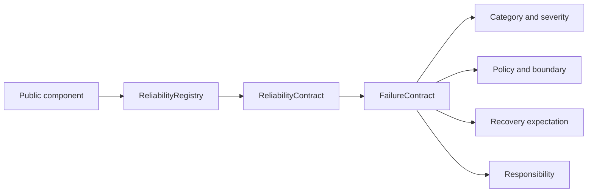

# Reliability Architecture

EPIP reliability metadata separates description from runtime execution.

## Coverage

The official registry covers Core, Kernel, EventBus, Replay, FeatureStore, market-data providers,
all analytical engines, Risk, Execution, Portfolio, adapters, plugins, and external boundaries.

## Availability model

Internal components remain available after rejected input where their existing runtime contract
permits it. Framework availability never implies availability of a broker, provider, filesystem,
network, or other external dependency.

## Audit model

Registry construction rejects duplicate components. Contract construction rejects missing fields,
duplicate categories, contradictory retry declarations, and ignored critical failures. Registry
audit reports missing required components in deterministic order.
