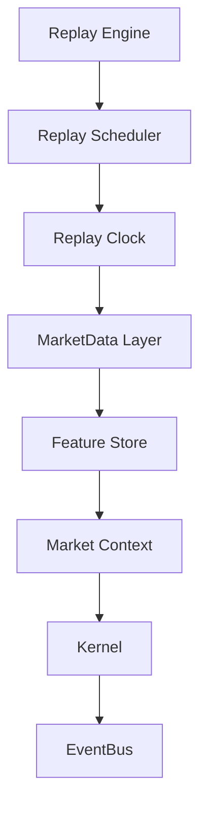
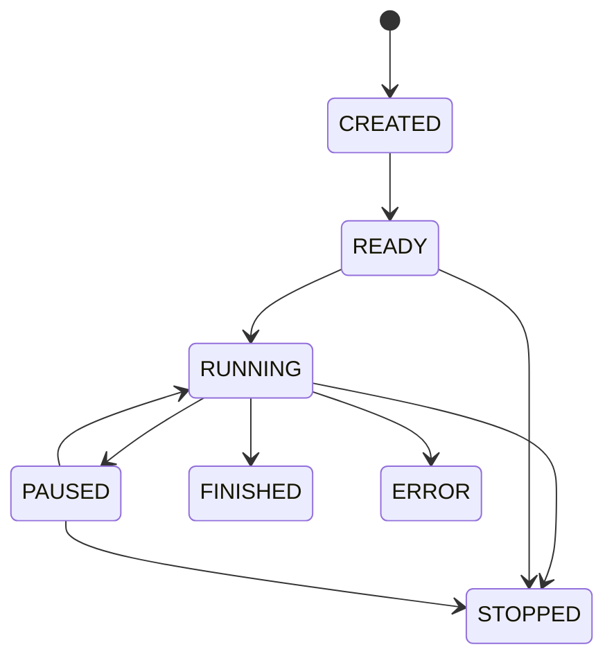
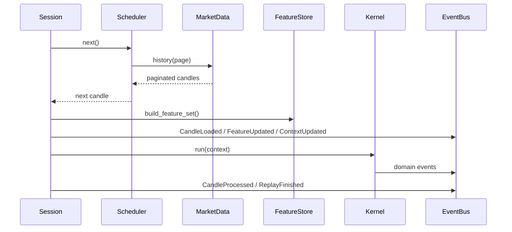

# Replay Engine Architecture (EPIP-005)

## Purpose

The Replay Engine is the official EPIP clock and orchestration layer for historical progression.
It streams market data through Market Data Layer, Feature Store, Market Context, Kernel, and EventBus without loading full history into memory.

## Architecture

## State Machine

## Sequence

## Responsibilities

- ReplayEngine: drive progressive processing and event publication.
- ReplayScheduler: merge multiple symbol/timeframe streams chronologically.
- ReplayClock: own replay time and state transitions.
- ReplayIterator: fetch paginated history lazily.
- ReplaySession: aggregate config, state, clock, statistics, and contexts.
- ReplayStatistics: compute throughput and latency metrics.

## Memory Strategy

- No eager full-history loading.
- Pagination-based lazy history loading through MarketData history requests.
- Per-stream rolling candle windows only.
- Suitable extension point for very large historical runs.

## Integration Boundaries

- No direct dependency on TwelveData or MT5.
- Market data access uses DataSourceProtocol only.
- Feature construction uses FeatureStore only.
- Analysis execution remains delegated to Kernel.
