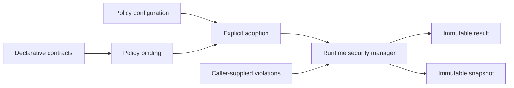

# Runtime Security Architecture

Runtime security is an optional layer above EPIP's declarative contracts. It
does not replace security contracts, trust-boundary contracts, or input
validation contracts.

An application creates a `SecurityPolicyBinding`, combines it with a disabled
or enabled `SecurityPolicyConfiguration`, and explicitly opts in through a
`RuntimeSecurityAdoption`. `RuntimeSecurityManager` rejects implicit adoption.

The manager records deterministic immutable results and exposes immutable
snapshots. It accepts typed violations from an application-owned validator;
the framework does not execute existing business components or infer failures.

