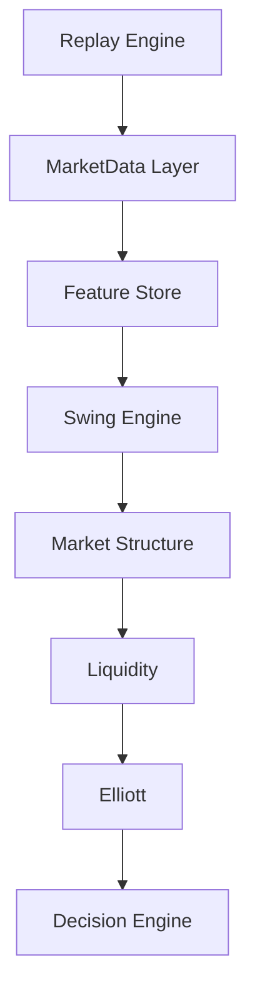
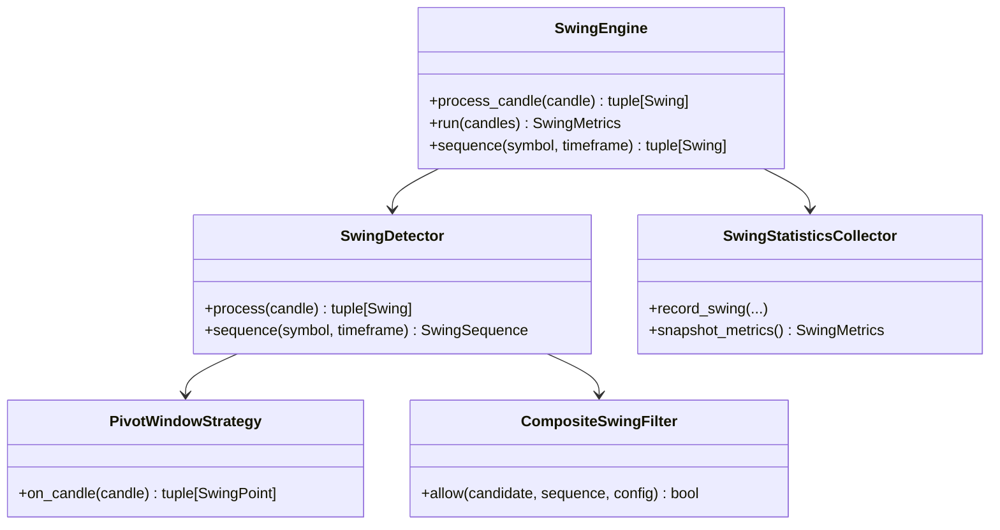
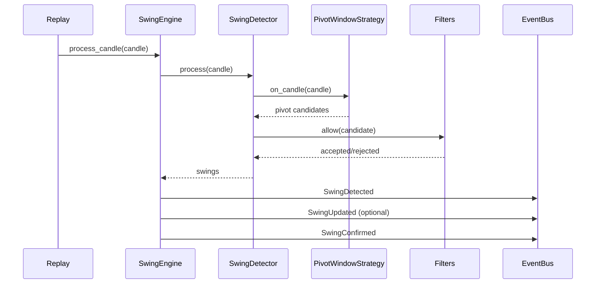

# Swing Engine Architecture (EPIP-006)

## Purpose

Swing Engine is the unique official source of pivots and swing classifications in EPIP.
All downstream modules (Market Structure, Liquidity, Elliott, ICT/SMC/Wyckoff/Fibonacci layers) must consume swings from this engine and must never recalculate pivots independently.

## Architecture

## Component Diagram

## Sequence Diagram

## Strategy Pattern

- Implemented: PivotWindowStrategy (official EPIP-006 baseline).
- Declared interfaces/placeholders: FractalStrategy, ATRAdaptiveStrategy, ZigZagStrategy, HybridStrategy.
- Rationale: maintain deterministic baseline while opening a controlled extension path.

## Algorithms

### PivotWindowStrategy

- Maintain a rolling buffer.
- Confirm pivot only after right_bars candles are available.
- Swing High: center high is maximum of local window.
- Swing Low: center low is minimum of local window.

### Classification

- High pivots: Swing High, Higher High, Lower High, Equal High.
- Low pivots: Swing Low, Higher Low, Lower Low, Equal Low.
- Scope: Internal/External by distance regime.

## Filters (Composable)

- Distance Filter
- ATR Filter
- Noise Filter
- Duplicate Filter
- Trend Filter
- Minimum Move Filter

All filters are combined by CompositeSwingFilter with logical AND.

## Streaming and Memory

- Streaming-only processing.
- No full candle history materialization.
- Per-stream rolling windows only.
- Designed for very large runs (1M/5M/10M candles) without OOM.

## Thread Safety

- SwingEngine, SwingDetector and SwingStatisticsCollector are protected by RLock.
- Public read/write operations are deterministic under concurrent access.

## Logging

- Uses logging module only.
- No print() in runtime path.
