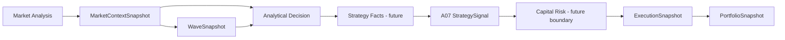

# EPIP Documentation

EPIP is a typed, event-driven Python framework for deterministic market analysis, decision making,
risk planning, and order execution. This site is the authoritative entry point for architecture,
public contracts, governance, quality, and contribution guidance through release `v1.6.0`.

## Start here

- [Project overview](project/PROJECT_OVERVIEW.md) explains goals, audience, and philosophy.
- [Architecture](project/ARCHITECTURE.md) presents layers, data flow, and dependency direction.
- [Modules](project/MODULES.md) provides the historical module reference.
- [Pipeline](project/PIPELINE.md) provides the historical engine-flow reference.
- [ADR-0016](adr/ADR-0016-CanonicalStrategyPipeline.md) governs the post-v1.6.0 pipeline.
- [API guide](project/API_GUIDE.md) explains snapshots, histories, graphs, EventBus, and versioning.
- [Developer guide](project/DEVELOPER_GUIDE.md) defines contribution and quality requirements.

## Official contracts

Each output has one owning engine. Downstream modules consume immutable official objects and never
duplicate upstream calculations. A07 is the sole final strategy authority; Portfolio is
implemented. Strategy Runtime and Fact Adapter contracts are the next milestone and are not yet
implemented.

## Governance and maintenance

Read the [architecture principles](project/ARCHITECTURE_PRINCIPLES.md),
[ADR index](project/DECISIONS.md), [API stability policy](project/API_STABILITY.md), and
[release policy](project/RELEASE_POLICY.md) before proposing framework changes. Security issues must
follow the private disclosure process in the repository security policy.

## Current status

- Release: `v1.6.0`
- A07 Strategy Engine: COMPLETE / CLOSED / FROZEN
- Portfolio Engine: implemented
- Next milestone: P01 Canonical Strategy Runtime and Fact Adapter Contract
- Quality: Black, Ruff, strict MyPy, and Pytest passing
- A07 closure aggregate coverage: 96.40%
- License: Apache-2.0
