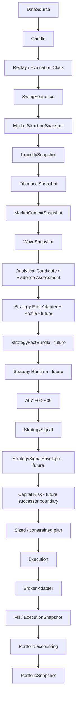

# Architecture

## Canonical authority

[ADR-0016](../adr/ADR-0016-CanonicalStrategyPipeline.md) is the normative post-v1.6.0 authority.
A07 E00-E09 are COMPLETE / CLOSED / FROZEN and A07 is the sole final strategy authority. The
Strategy Fact Adapter/Profile and Strategy Runtime shown below are future boundaries, not existing
implementations.

## Canonical target pipeline

Core Kernel may supply governed analytical evidence through a Fact Adapter. Its `Decision` and the
historical `DecisionSnapshot` are analytical compatibility outputs, not final strategy signals.
The implemented Replay engine does not orchestrate this complete target pipeline.

## Semantic layers and ownership

- **Infrastructure:** Market Data, Replay/evaluation clocks, EventBus, external adapters,
  persistence, and telemetry.
- **Domain analysis:** Swing, Market Structure, Liquidity, Fibonacci, Context, Elliott, historical
  Decision, and governed Core Kernel evidence.
- **Strategy fact adaptation:** future versioned adapters/profiles that translate official analysis
  into caller-authoritative A07 facts.
- **Strategy policy and signal:** frozen A07 policy, eligibility, direction, geometry, RR,
  confidence binding, expiration, and `StrategySignal`.
- **Capital Risk:** future signal-envelope consumer responsible for capital allocation, sizing,
  exposure, leverage, margin, drawdown, and portfolio constraints.
- **Execution:** accepted-plan validation, order lifecycle, broker access, fills, costs, and
  `ExecutionSnapshot`.
- **Portfolio:** positions, cash, equity, PnL, allocations, exposure, correlation, limits, and
  `PortfolioSnapshot`.

Historical Decision owns analytical candidates, scores, probabilities, quality, priority,
reasoning, evidence, and suggested geometry. A07 exclusively owns final direction, entry, stop,
target, risk/reward distance, RR and acceptance, confidence binding, expiration, and final signal.
Capital Risk rejects constraint violations instead of repairing strategy semantics. Execution does
not recompute strategy. Portfolio consumes fills and may publish an immutable pre-trade constraint
view; it does not decide trades.

## Strategy Runtime and time

The future Strategy Runtime validates immutable evaluation context, provenance, and temporal
coherence; selects a profile; invokes adapters; orchestrates A07 E00-E09; and emits a signal-context
envelope and diagnostics. It does not analyze markets, size capital, execute, read broker state, or
use ambient wall time.

Replay/backtest use `ReplayClock` or event time. Paper uses injected market/event time. MT5 demo
and live use normalized venue/event time with receipt time separate when required. Identical input
bundles, versions, and evaluation timestamps must produce identical strategy results.

## Dependency direction

Infrastructure feeds domain inputs; analysis consumes earlier public outputs; Fact Adapters consume
analysis and A07 fact contracts; Strategy Runtime consumes adapters and A07; Capital Risk consumes
signal envelopes and immutable portfolio-risk facts; Execution consumes an accepted plan;
Portfolio consumes execution/fills.

A07 must not depend on Runtime, Risk, Execution, Portfolio, brokers, or MT5. Analytics must not
depend on downstream execution state. Broker types stay outside domain contracts. Immutable read
models and domain-owned protocols prevent dependency cycles.

## Shared deployment runtime

Backtest, paper, MT5 demo, and live use the same analytical engines, adapters/profiles, Strategy
Runtime, A07 evaluation, Capital Risk contracts, and execution-plan contracts. Historical data,
clocks, broker transports, persistence, safety controls, and telemetry are replaceable adapters.
Mode-specific strategy implementations are forbidden.

## Public contracts and evolution

Existing snapshots and A07 objects remain governed public contracts. `EvaluationContext`,
`StrategyFactBundle`, runtime request/result and diagnostics, `StrategySignalEnvelope`, an immutable
portfolio-risk view, and a Capital Risk plan successor are FUTURE CONTRACTS owned by P01. Stable
APIs change only through additive evolution or governed compatibility/deprecation.

Architecture changes require one semantic owner, legal dependencies, immutable boundaries,
explicit time, typed failure, tests, documentation, an ADR, and architecture approval.
