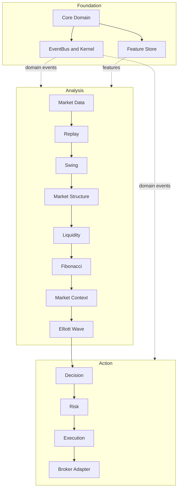
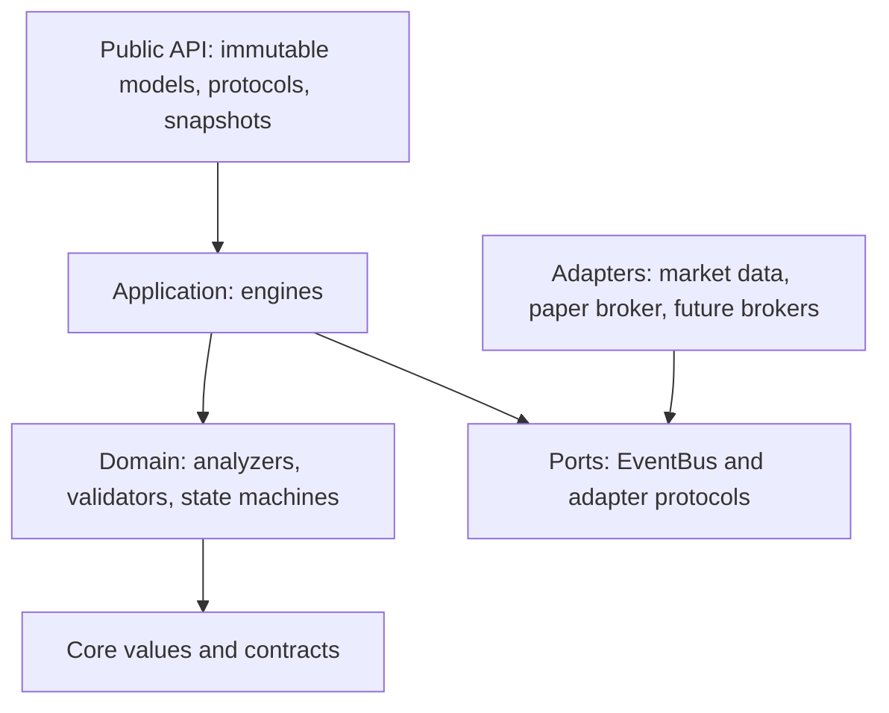
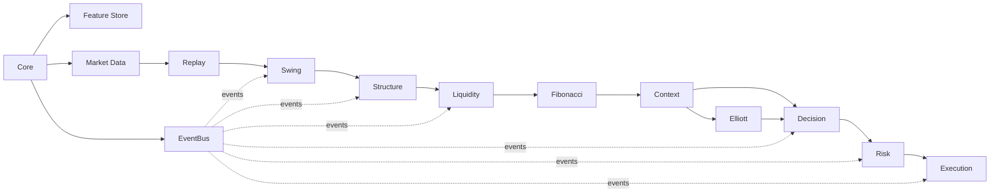

# Architecture

## Overall architecture

## Layered architecture

The public layer defines stable objects and protocols. Application engines coordinate domain
services. Domain code owns calculations and invariants. Ports invert dependencies toward adapters.
Core provides shared value objects, event infrastructure, plugin contracts, and kernel services.

## Module dependency graph

Dependencies follow the direction of official domain outputs. No downstream module reaches back to
recompute upstream state. Risk consumes `TradeDecision`; Execution consumes `PositionPlan`.

## Data flow

Data enters through provider protocols, is normalized, optionally replayed, and progressively
enriched. Analytical modules produce immutable snapshots, graph links, histories, metrics, and
events. Context aggregates analysis; Elliott interprets wave structure; Decision produces intent;
Risk produces an executable plan; Execution interacts with a broker adapter and records outcomes.

## Why each engine exists

Each engine isolates a reason to change: Replay controls time; Swing extracts pivots; Structure
classifies market behavior; Liquidity models pools and sweeps; Fibonacci models price geometry;
Context aggregates evidence; Elliott models wave hypotheses; Decision owns action selection; Risk
owns sizing and constraints; Execution owns order lifecycle and broker access. This division makes
the system replaceable, testable, and auditable without collapsing concerns into one service.

## Cross-cutting rules

Public outputs are immutable and versioned. Serialization is deterministic. Histories append rather
than mutate. Graphs preserve lineage. Stateful operations are protected with `RLock`. Events are
facts, not commands hidden inside domain objects. Adapters contain external-system concerns.
