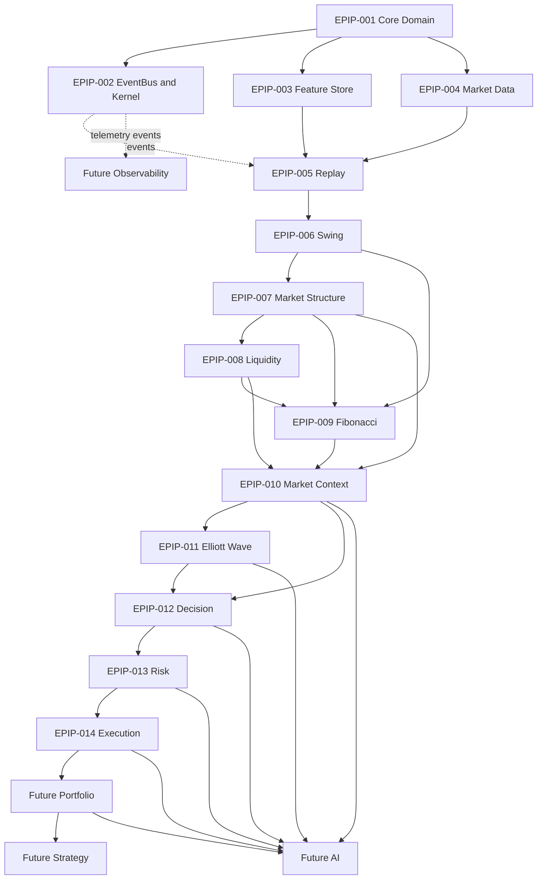

# Dependency Graph

## Complete framework tree

Arrows point from an official producer toward a consumer. EventBus dotted edges represent event
delivery rather than ownership of the consumer's domain logic.

## Module contracts

### EPIP-001 — Core Domain

- **Consumes:** validated primitives and application inputs.
- **Produces:** core values, candles, evidence, hypotheses, scenarios, base events and contracts.
- **Future consumers:** every framework module.
- **Dependencies:** Python standard library.
- **Forbidden dependencies:** all higher EPIP engines, providers, brokers, Portfolio, Strategy, AI.

### EPIP-002 — EventBus and Kernel

- **Consumes:** domain events, plugin contexts, registered plugin implementations.
- **Produces:** ordered event delivery, event history, kernel/plugin results.
- **Future consumers:** Observability, audit, integrations.
- **Dependencies:** Core.
- **Forbidden dependencies:** analytical, Decision, Risk, Execution and external messaging logic in
  the domain bus.

### EPIP-003 — Feature Store

- **Consumes:** normalized observations through feature providers.
- **Produces:** immutable `Feature` and `FeatureSet` objects.
- **Future consumers:** analysis, Strategy, AI research.
- **Dependencies:** Core and provider protocols.
- **Forbidden dependencies:** Market Structure through Execution, broker APIs, strategy policy.

### EPIP-004 — Market Data

- **Consumes:** vendor/file data through `DataSourceProtocol` adapters.
- **Produces:** normalized request/result, candle, cache and stream contracts.
- **Future consumers:** Replay and live-data orchestration.
- **Dependencies:** Core plus adapter-local external concerns.
- **Forbidden dependencies:** Replay, analysis, Decision, Risk, Execution and broker execution.

### EPIP-005 — Replay Engine

- **Consumes:** Market Data, clock configuration, Feature Store and Kernel ports.
- **Produces:** deterministic replay progression, sessions, state, metrics and events.
- **Future consumers:** research, backtesting, Strategy.
- **Dependencies:** Core, EventBus, Market Data, Feature Store/Kernel contracts.
- **Forbidden dependencies:** concrete vendors, downstream analytical calculations, Risk, brokers.

### EPIP-006 — Swing Engine

- **Consumes:** ordered candles/price observations.
- **Produces:** `SwingPoint`, `Swing`, `SwingSequence`, classifications, statistics and events.
- **Future consumers:** Structure, Fibonacci, Context, Elliott.
- **Dependencies:** Core and EventBus.
- **Forbidden dependencies:** Structure, Liquidity, Fibonacci, Context, Decision, Risk, Execution.

### EPIP-007 — Market Structure Engine

- **Consumes:** official `SwingSequence` objects.
- **Produces:** trend, BOS, CHOCH, range state, structure snapshots, graph, history and events.
- **Future consumers:** Liquidity, Fibonacci, Context, Decision/AI evidence.
- **Dependencies:** Core, EventBus, Swing contracts.
- **Forbidden dependencies:** Market Data/Replay implementations and all downstream engines.

### EPIP-008 — Liquidity Engine

- **Consumes:** official Swing and Market Structure outputs.
- **Produces:** pools, sweeps, equal levels, FVGs, voids, clusters, tree, snapshot, graph/history.
- **Future consumers:** Fibonacci, Context, Decision, AI.
- **Dependencies:** Core, EventBus, Swing and Structure contracts.
- **Forbidden dependencies:** Fibonacci, Context, Elliott, Decision, Risk, Execution, brokers.

### EPIP-009 — Fibonacci Engine

- **Consumes:** official Swing, Structure and Liquidity outputs.
- **Produces:** levels, zones, OTE, projections, clusters, alignment and Fibonacci snapshots.
- **Future consumers:** Context, Elliott, Decision, AI.
- **Dependencies:** Core, EventBus and upstream analytical contracts.
- **Forbidden dependencies:** Context, Elliott, Decision, Risk, Execution, brokers.

### EPIP-010 — Market Context Engine

- **Consumes:** official Swing, Structure, Liquidity and Fibonacci snapshots.
- **Produces:** phase, bias, confluence and `MarketContextSnapshot` with graph/history/events.
- **Future consumers:** Elliott, Decision, Strategy, AI.
- **Dependencies:** Core, EventBus and EPIP-006–009 contracts.
- **Forbidden dependencies:** Elliott, Decision, Risk, Execution, Portfolio, brokers.

### EPIP-011 — Elliott Wave Engine

- **Consumes:** official `MarketContextSnapshot` and its published evidence.
- **Produces:** wave counts, alternates, degrees, projections, targets and `WaveSnapshot`.
- **Future consumers:** Decision and AI.
- **Dependencies:** Core, EventBus, Market Context.
- **Forbidden dependencies:** Decision, Risk, Execution, Portfolio and broker adapters.

### EPIP-012 — Decision Engine

- **Consumes:** aligned `MarketContextSnapshot` and `WaveSnapshot`.
- **Produces:** the official `TradeDecision` inside `DecisionSnapshot`, plus graph/history/events.
- **Future consumers:** Risk, Strategy and AI.
- **Dependencies:** Core, EventBus, Context and Elliott contracts.
- **Forbidden dependencies:** Risk sizing, Execution, Portfolio, broker adapters.

### EPIP-013 — Risk Engine

- **Consumes:** only the official `TradeDecision`/`DecisionSnapshot` contract plus scalar risk
  observations supplied by callers.
- **Produces:** the official `PositionPlan`, `RiskSnapshot`, graph/history/events and metrics.
- **Future consumers:** Execution, Portfolio and AI.
- **Dependencies:** Core, EventBus, Decision.
- **Forbidden dependencies:** Market analysis engines, Execution, Portfolio, broker APIs.

### EPIP-014 — Execution Engine

- **Consumes:** only accepted official `PositionPlan` objects.
- **Produces:** orders, fills, reports, events and the official `ExecutionSnapshot` with graph/history.
- **Future consumers:** Portfolio, Monitoring and AI.
- **Dependencies:** Core, EventBus, Risk contract and broker adapter protocol.
- **Forbidden dependencies:** analysis, Decision recomputation, position sizing, Portfolio policy,
  direct broker SDK use outside adapters.

## Enforcement rule

A module may depend on Core, EventBus, and explicitly documented upstream contracts. It must never
import a downstream engine, bypass an official object, duplicate another domain's calculation, or
leak an external adapter into domain models.
