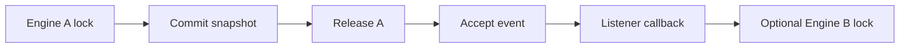

# Deadlock Prevention

## Prevented Paths

Programme B removes the principal callback ABBA path:

Because Engine A is released before the callback, a second thread holding Engine B cannot form the
inverse B-to-A callback cycle through this publication.

## Defensive Rules

- Listener snapshots are immutable tuples.
- Callback execution is single-dispatcher and lock-free with respect to EventBus.
- Concurrent publishers wait without holding EventBus state locks.
- Recursive events are queued instead of recursively dispatched.
- Cross-thread publications made during a callback return after acceptance, allowing a listener to
  join the publishing thread without waiting indirectly for its own completion.
- Dispatch cycles have a finite publication limit.
- Engine publication-under-lock is guarded by an automated AST test.

## Cross-thread callback policy

Ordinary concurrent publishers remain synchronous. While a listener callback is active, a new
publisher on another thread receives an acceptance guarantee rather than a completion guarantee.
The event remains FIFO and is delivered by the existing dispatcher after the current callback. This
policy removes the cycle in which the listener joins a publisher that is waiting for that listener
to return.

## Out of Scope

This programme does not eliminate deadlocks caused solely by provider adapters, broker callbacks,
logging handlers, user-managed locks, or direct calls between engines outside EventBus. Those risks
remain governed by concurrency contracts and later Hardening-004 programmes.
