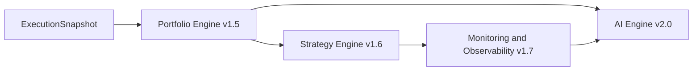

# Future

## Portfolio Engine — v1.5.0

Portfolio will consume only official execution outcomes to maintain positions, cash, realized and
unrealized P&L, allocation, exposure, concentration, and portfolio history. It must not communicate
with brokers or repeat Risk sizing.

## Strategy Engine — v1.6.0

Strategy will orchestrate policies over official Context, Decision, Risk, Execution, and Portfolio
objects. It will coordinate intent and scheduling without absorbing the bounded responsibilities of
those engines.

## Monitoring and Observability — v1.7.0

This layer will consume events and metrics for health, traces, audit logs, latency, throughput,
alerts, dashboards, and operational diagnostics. Observability must remain non-invasive and must not
alter deterministic domain outputs.

## AI Engine — v2.0.0

AI will consume immutable snapshots, histories, graphs, metrics, and portfolio state for
explanation, ranking, anomaly detection, and assisted research. It must not bypass Decision, Risk,
Execution, or Portfolio authority. Governance, provenance, reproducibility, uncertainty, and human
oversight are release requirements.

## Long-term vision

EPIP aims to be an explainable, broker-neutral, replayable framework spanning research, controlled
decision making, risk, execution, portfolio management, and governed intelligence. Stable contracts
allow individual modules to evolve without sacrificing auditability or system ownership.
