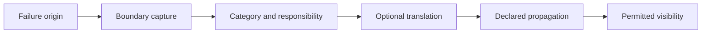

# Failure Propagation

## Declarative sequence

## Rules

1. Programming errors fail at the owning internal boundary.
2. Invalid caller data remains caller-correctable.
3. Provider and adapter failures retain their original responsibility.
4. Technical implementation errors are not part of the intended public model.
5. Logging belongs to the responsibility declared by the boundary.
6. Recovery expectations are descriptive and do not activate recovery.
7. Retry and compensation remain inactive in Programme B.

Translation is required only when an internal exception would otherwise leak a
technical detail across a public or external boundary. The declarations state
the intended rule but do not modify exception flow.
