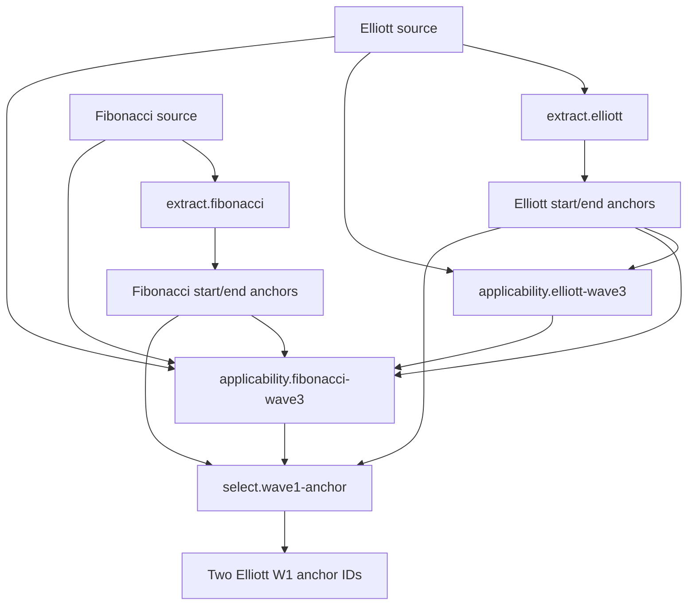

# P04-F01-R01 — Elliott/Fibonacci Wave-3 Setup Qualification Contract

Status: **COMPLETE / CLOSED / FROZEN**

Scope: P04-F01 implementation and closure only

## Authority and prerequisites

This contract reconciles P04 Governance Authorization, P04-R00, P04-F00-R02,
P04-F00-R03, P02-R03, P02-R04, ADR-0029, and the current public Elliott,
Fibonacci, P02 request/result, serialization, identity, catalog, and profile
contracts. P02-R03 and P02-R04 are complete, closed, and frozen. P04-F00 and
P04-F00-R03 are closed and frozen.

P04-F01 is authorized only for the five rules below. P04-F02, P04-F03,
P04-F04, and P05 remain **NOT AUTHORIZED**.

## Frozen identities

The implementation must use these existing identities without changing any ID,
version, schema version, fingerprint, family, invocation kind, or result kind:

| Suffix | Fingerprint | Family | Invocation | Result |
| --- | --- | --- | --- | --- |
| `extract.elliott` | `24b1377eebc63f670f7cca1f6f857f99007a6186889540fde86a3b2683eb5b85` | `SOURCE_EXTRACTION` | `SOURCE_EXTRACTION` | `CANDIDATES` |
| `extract.fibonacci` | `bfba1b01a2d3d1aceffecd4a129497d6b7d2c1c4d943f3d226d59fe2aea12ef3` | `SOURCE_EXTRACTION` | `SOURCE_EXTRACTION` | `CANDIDATES` |
| `applicability.elliott-wave3` | `9bc267a1684478ead3e1f9f1b9fef6d84f0bcfb21722dbb80d25b4fdadf8c491` | `APPLICABILITY` | `STRUCTURAL_APPLICABILITY` | `APPLICABILITY` |
| `applicability.fibonacci-wave3` | `a5b9265f0cbd40f31d70473b1130b13dbf41e1542558748fd73fcbc513703369` | `APPLICABILITY` | `STRUCTURAL_APPLICABILITY` | `APPLICABILITY` |
| `select.wave1-anchor` | `2c7a03123e2ef99ec576255c097d0383c23695ffd1d65d5029c12d93328787f4` | `CANDIDATE_SELECTION` | `SELECTION` | `SELECTION` |

Every complete rule ID is the suffix prefixed by
`p04.elliott-fibonacci-wave3.`; every version is `1.0.0` and every rule schema
version is `p02-f00-v1`. No sixth F01 rule is authorized.

## Common request and result rules

Every rule uses its exact frozen request type. The resolved P02 boundary rejects
a wrong request class before implementation invocation. Implementations also
fail closed on malformed populations and do not inspect callable signatures,
rule-name strings, tuple position, the filesystem, environment, clock, network,
randomness, or mutable registries.

Extraction success is `CandidateRuleResult(SUCCESS, (), candidates)`.
Structural qualification success is `ApplicabilityResult(SUCCESS, (), True)`.
Structural rejection is `ApplicabilityResult(REJECTED, diagnostics, None)`;
there is no `QUALIFICATION` candidate. Selection success is
`SelectionRuleResult(SUCCESS, (), selected_candidate_ids)`. Non-success results
carry no output, as required by the frozen P02 result-shape contract.

## Elliott extraction

`extract.elliott` accepts exactly `SourceExtractionRequest` containing one
`AnalyticalSourceBinding` whose kind is `ELLIOTT` and whose exact typed payload
is `WaveSnapshot`.

It reads the first primary-sequence wave and emits exactly two
`SemanticCandidate` values:

| Meaning | Value | Role |
| --- | --- | --- |
| first primary wave start | `SemanticValue(PRICE, float_value=wave.start_price)` | `ANCHOR_START` |
| first primary wave end | `SemanticValue(PRICE, float_value=wave.end_price)` | `ANCHOR_END` |

Both candidates carry the extraction rule identity, source binding ID,
provenance reference, instrument binding ID, and concrete source timeframe.
P02 canonicalizes output order by candidate ID; role, never order, carries
meaning.

Wrong source kind/payload, invalid source/context/provenance, an empty primary
sequence, or unusable non-finite/non-positive endpoint data is `INVALID_INPUT`.
A present first wave with a non-`WAVE_1` label is a well-formed semantic
non-match and is `REJECTED`. Extraction does not require the final two-wave
shape, valid count, empty violations/alternates, W2 continuity, W2-origin rule,
or W3 projection; those predicates belong to applicability.

## Fibonacci extraction

`extract.fibonacci` accepts exactly `SourceExtractionRequest` containing one
`AnalyticalSourceBinding` whose kind is `FIBONACCI` and whose exact typed payload
is `FibonacciSnapshot`.

It emits exactly two candidates from
`snapshot.retracement.start_price` and `snapshot.retracement.end_price`, both
with `PRICE` values and respective `ANCHOR_START` and `ANCHOR_END` roles. Each
retains the Fibonacci extraction identity and the exact source, provenance,
instrument, and timeframe bindings. Output order is canonical candidate-ID
order.

Wrong source kind/payload, invalid source/context/provenance, or non-finite or
non-positive endpoints is `INVALID_INPUT`. Finite equal endpoints, `RANGE`, or
snapshot/retracement orientation disagreement remain representable and are
rejected by structural applicability. F01 emits no `ENTRY`, `ZONE`, `TARGET`,
extension-1.618, confidence, or evidence candidate.

## Elliott structural applicability

`applicability.elliott-wave3` accepts exactly
`StructuralApplicabilitySetRequest` with:

- exactly two candidates produced by `extract.elliott`;
- exactly one `ANCHOR_START` and one `ANCHOR_END`;
- exactly one `ELLIOTT` source binding whose payload is `WaveSnapshot`;
- no unrelated candidate or source.

Candidate values must exactly equal the first primary wave's start/end prices.
Candidate source, provenance, instrument, and timeframe must match that source
and the common invocation context.

The payload qualifies only when all predicates hold:

1. the primary sequence contains exactly two waves;
2. its pattern is exactly `WavePattern.UNKNOWN`, representing an incomplete
   five-leg impulse and a completed two-leg prefix;
3. the waves are respectively `WAVE_1` and `WAVE_2`;
4. `primary.status` is `VALID`, `primary.violations` is empty, and analysis
   alternates are empty;
5. `sequence.degree == W1.degree == W2.degree`;
6. W1 direction is exactly `UP` or `DOWN`, and W2 has the opposite value;
7. `W2.start_index == W1.end_index`;
8. `W2.start_timestamp == W1.end_timestamp`;
9. `W2.start_price == W1.end_price` exactly;
10. for `UP`, `W2.end_price > W1.start_price`; for `DOWN`,
    `W2.end_price < W1.start_price`;
11. the singular optional projection is present and
    `projection.next_wave == WAVE_3`.

Exactly two primary waves proves W3 is not already completed. The model exposes
one optional `WaveProjection`, so zero means absent, one is evaluated, and a
multiple/ambiguous projection state is not constructible through the exact
public model. Equality or crossing at W1 origin, a missing projection, a
non-W3 projection, unsupported direction, extra/missing waves, alternate
counts, violations, or any well-formed predicate mismatch is `REJECTED`.

## Fibonacci structural applicability

`applicability.fibonacci-wave3` accepts exactly
`StructuralApplicabilitySetRequest` with four candidates and two sources:

- one Elliott `ANCHOR_START` and one Elliott `ANCHOR_END`, identified by the
  frozen Elliott extraction identity;
- one Fibonacci `ANCHOR_START` and one Fibonacci `ANCHOR_END`, identified by the
  frozen Fibonacci extraction identity;
- exactly one `ELLIOTT` binding with `WaveSnapshot` payload;
- exactly one `FIBONACCI` binding with `FibonacciSnapshot` payload.

No extra source domain or candidate is accepted. Sources are identified by
exact source kind, not tuple position. Each candidate is identified by exact
source-rule identity and role, not tuple position. Duplicate role cardinality
within either producer, missing roles, wrong value kinds, unknown source-rule
identity, or extra members is `INVALID_INPUT`.

All sources and candidates must independently match the same invocation
context: evaluation authority, instrument binding, concrete PRIMARY timeframe,
PRIMARY role, source-binding admission, and provenance admission. Distinct
producer and source-binding identities are required and retained; they are not
equated or merged.

Qualification requires exact equality among:

- Elliott candidates and W1 `start_price`/`end_price`;
- Fibonacci candidates and retracement `start_price`/`end_price`;
- Fibonacci start/end and Elliott W1 start/end.

For Elliott `UP`, W1 start is below end and both
`snapshot.direction` and `retracement.direction` are `BULLISH`. For Elliott
`DOWN`, W1 start is above end and both Fibonacci directions are `BEARISH`.
`RANGE`, equal endpoints, direction disagreement, endpoint mismatch, or another
well-formed cross-domain non-match is `REJECTED`.

Fibonacci has no Elliott wave index, timestamp, `WaveCount` identity, or degree.
No join on those nonexistent dimensions is permitted. F01 does not evaluate a
golden-zone entry, extension target, RR, confidence, evidence, or
`StrategyDirection`.

## Anchor selection

`select.wave1-anchor` accepts exactly `CandidateSelectionRequest` with
`direction=None` and the four already qualified Elliott/Fibonacci anchor
candidates described above. The request must contain one start and one end from
each frozen extraction identity. It returns exactly the two Elliott candidate
IDs.

The returned tuple is canonicalized by P02. The role on the referenced Elliott
candidate determines start versus end; result position has no meaning. Missing
roles, duplicate roles, extra candidates, unknown producers, multiple possible
pairs, or source/value disagreement is `REJECTED`; ambiguity uses
`AMBIGUOUS_CANDIDATE`. The rule never selects a lexical-first candidate and does
not use `selection_winner`.

## Failure classification

| Condition | Exact outcome |
| --- | --- |
| Wrong request class at resolved boundary | `DataIntegrityError` before rule call |
| Malformed source contract, payload type, context, provenance, identity, enum, or non-finite required value | `INVALID_INPUT` / `RULE_INPUT_INVALID` |
| Empty/duplicate P02-R04 population rejected during request construction | `DataIntegrityError` |
| Structurally wrong candidate/source count, kind, role, value kind, producer identity, or context relation | `INVALID_INPUT` / `RULE_INPUT_INVALID` |
| Well-formed non-W1 first wave | extraction `REJECTED` / `RULE_REJECTED` |
| Well-formed invalid W1/W2 progression or count state | Elliott applicability `REJECTED` / `RULE_REJECTED` |
| W2 touches/crosses W1 origin | Elliott applicability `REJECTED` / `RULE_REJECTED` |
| Missing or non-W3 projection | Elliott applicability `REJECTED` / `RULE_REJECTED` |
| Fibonacci endpoint or orientation mismatch | Fibonacci applicability `REJECTED` / `RULE_REJECTED` |
| Missing/duplicate/ambiguous selection role or pair | selection `REJECTED`; ambiguity includes `AMBIGUOUS_CANDIDATE` |
| Unexpected implementation exception | `FAILED` at the existing orchestration boundary |

No non-success rule result carries candidates, applicability, or selected IDs.

## Directed execution and barriers

Failure or non-success at Elliott extraction prevents Elliott applicability.
Failure or rejection at Elliott applicability prevents cross-domain
applicability and selection. Failure at Fibonacci extraction prevents
cross-domain applicability. Failure or rejection at Fibonacci applicability
prevents selection. Selection failure prevents every future F02 call. Tests
must use recording implementations/spies to prove zero downstream calls at each
barrier.

## Orientation and ownership boundary

F01 may inspect only analytical orientation: exact Elliott strings `UP` and
`DOWN`, and exact Fibonacci values `BULLISH` and `BEARISH`. It neither accepts
nor emits `StrategyDirection`, `BUY`, `SELL`, or `NO_TRADE`. F01 owns no entry
membership, geometry, stop, target, RR, confidence, evidence, runtime/A07
invocation, or P05 multi-timeframe behavior.

All inputs remain immutable. Implementations must not mutate `WaveSnapshot`,
`FibonacciSnapshot`, `AnalyticalSourceBinding`, `SemanticCandidate`, invocation
context, profile, catalog, or identity objects.

## Catalog and executable closure

At implementation closure, exactly the five entries in this artifact transition
from `DECLARATION_ONLY` to `EXECUTABLE` and receive stable implementation IDs.
The other 32 entries remain `DECLARATION_ONLY` with no implementation ID.

The exact five identities must equal the executable catalog identity set, the
semantic-profile executable closure, `ResolvedRuleManifest.declarations`, and
`ResolvedSemanticRuleSet.implementations`. Expected executable closure is five.
`RULE_MANIFEST` becomes the five-declaration manifest, and a public `RULE_SET`
exposes the matching resolved implementation set. No frozen fingerprint changes.

## Authorized implementation scope

Expected production files are exactly:

- new `epip/strategy_profiles/elliott_fibonacci/setup_rules.py` containing the
  five immutable executable rule implementations;
- `epip/strategy_profiles/elliott_fibonacci/profile.py` for the five catalog
  transitions, exact manifest, and resolved set;
- `epip/strategy_profiles/elliott_fibonacci/__init__.py` for deliberate public
  exports.

Expected tests are exactly:

- new `tests/strategy_profiles/elliott_fibonacci/test_setup_rules.py`;
- `tests/strategy_profiles/elliott_fibonacci/test_profile.py` for the catalog,
  manifest, resolved-set, export, and fingerprint closure.

No P02, P03, A07, analytical-domain, serializer, or other P04 production file
is expected. If another production file or a sixth rule is required,
implementation must stop for governance review.

## Implementation test matrix — 82 conditions

The minimum implementation matrix is exactly 82 governed conditions:

| Group | Count | Required coverage |
| --- | ---: | --- |
| Elliott extraction | 10 | bullish/bearish values, exact count, roles, identity, provenance, canonical order, wrong kind, empty primary, malformed endpoint |
| Fibonacci extraction | 10 | bullish/bearish values, exact count, roles, identity, provenance, canonical order, wrong kind, malformed endpoints, no later-role leakage |
| Elliott applicability | 18 | bullish/bearish success; exact population; W1/W2 labels; pattern; count; violations; alternates; degree; directions; index, timestamp, and price continuity; origin equality/cross; missing/wrong projection; extra/completed W3 |
| Fibonacci applicability | 14 | success; exact population; start/end mismatch; both orientation mismatches; equal/range endpoints; instrument, timeframe, evaluation, and provenance mismatch; distinct producers; unsupported joins absent |
| Anchor selection | 9 | exact pair; two-ID output; permutation independence; direction exclusion; missing start/end; duplicate start/end; multiple-pair ambiguity |
| Execution barriers | 5 | no call after Elliott extraction, Elliott applicability, Fibonacci extraction, Fibonacci applicability, or selection failure |
| Isolation and determinism | 8 | no StrategyDirection, ENTRY, stop/target, RR, confidence/evidence, P05, nondeterministic dependency, or input mutation |
| Compatibility and closure | 8 | five fingerprints; five transitions; 32 declarations; manifest equality; resolved equality; serialization; P02/P03/A07 regression; compliance stability |

Happy paths cover bullish and bearish flows. Negative and boundary tests mutate
one governed fact at a time. Provenance tests retain distinct producers.
Barrier tests record exact invocation counts. Compatibility tests prove no
predecessor node removal or identity change.

## P02-R04 fit and gap disposition

P02-R04 supplies all required capabilities:

1. Elliott qualification can access the complete typed `WaveSnapshot`: **YES**.
2. Fibonacci qualification can access both typed payloads: **YES**.
3. Both applicability rules can receive their exact candidate populations:
   **YES**.
4. Existing source-rule identity and candidate roles are sufficient: **YES**.
5. Pair selection is expressible without tuple-position semantics: **YES**.
6. Duplicate candidate/source identities fail closed: **YES**.
7. Independent provenance is retained: **YES**.
8. Request dispatch is exact: **YES**.
9. Another P02 change is needed: **NO**.

Gap classification after reconciliation:

- G0: repository identity, five identities, requests/results, dataflow,
  cardinalities, failures, barriers, scope, and closure are exact;
- G1: historical prose naming the singular structural request is superseded by
  P02-R04 and this artifact;
- G2: canonical populations, pair-set semantics, provenance, serializer, and
  exact dispatch are satisfied by frozen P02-R03/P02-R04 authority;
- G3: none unresolved;
- G4: none unresolved;
- G5: none unresolved.

## Implementation closure

P04-F01 implements exactly the five frozen rules in
`epip/strategy_profiles/elliott_fibonacci/setup_rules.py`. The catalog contains
five executable and 32 declaration-only entries; `RULE_MANIFEST` and
`RULE_SET` contain the same five identities and unchanged fingerprints.

Closure validation recorded 82 new test nodes, increasing collection from
2,992 to 3,074 with zero predecessor removals. The selected regression passed
3,073 tests with the single designated EventBus stress test deselected; that
stress test passed independently. The compliance inventory remained 610 with
digest `522ea5bed864f02263ac38219ca3e8ff9bbd91f1905b842e42bb41c050c9e218`.
Focused changed-module coverage was 97% overall, with `setup_rules.py` at 96%
and `profile.py` at 100%.

P04-F01 is **COMPLETE / CLOSED / FROZEN**. P04-F02, P04-F03, P04-F04, and P05
remain **NOT AUTHORIZED**.
