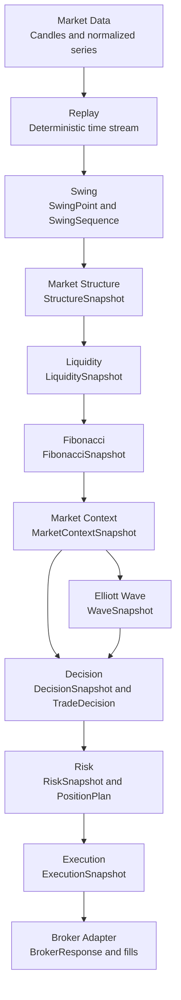

# Trading Pipeline

## Stage contracts

1. **Market Data** validates and normalizes provider data into stable candle/data-source objects.
2. **Replay** schedules those observations against a deterministic clock for research and testing.
3. **Swing** consumes ordered candles and produces pivots, swings, sequences, statistics, and events.
4. **Structure** consumes swing information to identify trend, ranges, BOS, CHOCH, and state.
5. **Liquidity** consumes price/structure observations to model equal levels, pools, sweeps, FVGs,
   voids, clusters, strength, ranking, and multi-timeframe relationships.
6. **Fibonacci** consumes swing geometry to produce retracements, extensions, OTE, zones,
   projections, alignment, probability, clusters, and institutional-entry context.
7. **Market Context** aggregates official analytical outputs into phase, bias, confluence, and a
   versioned context snapshot.
8. **Elliott Wave** consumes Market Context and structural observations to produce validated wave
   counts, alternatives, degrees, projections, targets, and scores.
9. **Decision** consumes aligned Context and Elliott snapshots and produces the sole official
   `TradeDecision`, including action, scores, confidence, rationale, and suggested zones.
10. **Risk** consumes only `TradeDecision`/`DecisionSnapshot`; it produces the sole official
    `PositionPlan` with sizing, stops, targets, exposure, drawdown, leverage, and margin controls.
11. **Execution** consumes only accepted `PositionPlan` objects and produces `ExecutionSnapshot`
    through an explicit order lifecycle and broker adapter.

The arrows are ownership boundaries. A downstream stage consumes official output; it does not
duplicate the calculation that produced it.
