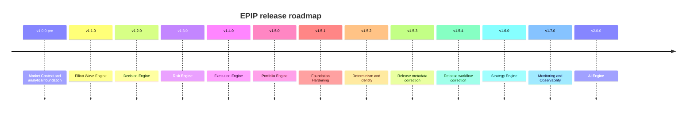

# Roadmap

## Completed releases

- **v1.0.0-pre:** completed the core analytical pipeline through Market Context, combining Core,
  EventBus, Feature Store, Market Data, Replay, Swing, Structure, Liquidity, and Fibonacci outputs.
- **v1.1.0:** added Elliott wave detection, validation, alternate counts, degrees, projections,
  graph/history, scoring, and Market Context integration.
- **v1.2.0:** established the single Decision Engine for rules, scores, confidence, probability,
  priority, rationale, entry/exit suggestions, and immutable `TradeDecision` snapshots.
- **v1.3.0:** established the Risk Engine as the sole sizing authority and introduced
  `PositionPlan`, portfolio limits, stops, targets, exposure, drawdown, leverage, and margin.
- **v1.4.0:** established the Execution Engine as the sole broker boundary with explicit order
  lifecycle, paper trading, adapters, fills, retry, costs, history, and graph.
- **v1.5.0:** established the Portfolio Engine for positions, allocation, cash, P&L, exposure,
  drawdown, correlation groups, and portfolio-level risk limits.
- **v1.5.1:** delivered repository governance, open-source infrastructure, security automation,
  MkDocs, CodeQL, Dependabot, and developer-experience hardening.
- **v1.5.2:** delivered Hardening-001 deterministic clocks, identity generators, event metadata,
  serialization identity preservation, and reproducible replay support.
- **v1.5.3:** corrects release metadata and Markdown validation for the Hardening-001 delivery.
- **v1.5.4:** makes annotated-tag validation reliable in GitHub Actions runners.

## Planned releases

- **v1.6.0 — Strategy Engine:** orchestrate portfolio-aware strategy policies without duplicating
  analysis, decision, risk, or execution calculations.
- **v1.7.0 — Monitoring & Observability:** metrics, tracing, health, audit streams, operational
  dashboards, and alerting across engine boundaries.
- **v2.0.0 — AI Engine:** explainable AI assistance over official snapshots and histories, subject
  to deterministic safety, governance, and human-control boundaries.

Roadmap items are intentions, not compatibility guarantees, until accepted by an ADR and released.
