# Roadmap

```mermaid
timeline
    title EPIP release roadmap
    v1.0.0-pre : Market Context and analytical foundation
    v1.1.0 : Elliott Wave Engine
    v1.2.0 : Decision Engine
    v1.3.0 : Risk Engine
    v1.4.0 : Execution Engine
    v1.5.0 : Portfolio Engine
    v1.5.1 : Foundation Hardening
    v1.5.2 : Determinism and Identity
    v1.5.3 : Release metadata correction
    v1.5.4 : Release workflow correction
    v1.5.5 : Hardening-002 Data Integrity
    v1.5.6 : Hardening-002 release metadata correction
    v1.5.7 : Hardening-003 Financial Correctness
    v1.5.8 : Hardening-003 release metadata correction
    v1.5.9 : Hardening-004 Thread Safety and Concurrency
    v1.5.10 : Hardening-005 Memory Safety and Resource Management
    v1.5.11 : Hardening-005 release metadata correction
    v1.5.12 : Hardening-006 Reliability and Fault Tolerance
    v1.5.13 : Hardening-006 release metadata correction
    v1.5.14 : Hardening-007 Security and Defensive Programming
    v1.5.15 : Hardening-007 release metadata correction
    v1.5.16 : EPIP-016 Decision Theory Framework
    v1.5.17 : EPIP-016 release metadata correction
    v1.5.18 : A06 architectural closure
    v1.5.19 : A06 release metadata correction
    v1.5.20 : A06 changelog and release metadata correction
    v1.5.21 : A06 package release metadata correction
    v1.6.0 : Strategy Engine
    v1.7.0 : Monitoring and Observability
    v2.0.0 : AI Engine
```

## Completed releases

- **v1.6.0:** released the A07 Strategy Engine. E00-E09 are COMPLETE / CLOSED / FROZEN at the
  canonical 2643-test technical baseline.
- **v1.5.18:** A06 architectural closure, with E00-E09 CLOSED / FROZEN. The release preserves
  the v1.6.0 Strategy Engine reservation.

- **v1.0.0-pre:** completed the core analytical pipeline through Market Context, combining Core,
  EventBus, Feature Store, Market Data, Replay, Swing, Structure, Liquidity, and Fibonacci outputs.
- **v1.1.0:** added Elliott wave detection, validation, alternate counts, degrees, projections,
  graph/history, scoring, and Market Context integration.
- **v1.2.0:** established the single Decision Engine for rules, scores, confidence, probability,
  priority, rationale, entry/exit suggestions, and immutable `TradeDecision` snapshots.
- **v1.3.0:** established the Risk Engine as the sole sizing authority and introduced
  `PositionPlan`, portfolio limits, stops, targets, exposure, drawdown, leverage, and margin.
- **v1.4.0:** established the Execution Engine as the sole broker boundary with explicit order
  lifecycle, paper trading, adapters, fills, retry, costs, history, and graph.
- **v1.5.0:** established the Portfolio Engine for positions, allocation, cash, P&L, exposure,
  drawdown, correlation groups, and portfolio-level risk limits.
- **v1.5.1:** delivered repository governance, open-source infrastructure, security automation,
  MkDocs, CodeQL, Dependabot, and developer-experience hardening.
- **v1.5.2:** delivered Hardening-001 deterministic clocks, identity generators, event metadata,
  serialization identity preservation, and reproducible replay support.
- **v1.5.3:** corrects release metadata and Markdown validation for the Hardening-001 delivery.
- **v1.5.4:** makes annotated-tag validation reliable in GitHub Actions runners.
- **v1.5.5:** delivered Hardening-002 fail-fast validation, immutable payload protection,
  domain-specific integrity errors, and automated compliance coverage.
- **v1.5.6:** aligns all release metadata for the Hardening-002 delivery while preserving the
  already-published v1.5.5 tag.
- **v1.5.7:** delivered Hardening-003 periodic PnL semantics, average-cost accounting, commission
  and fill validation, and enforced portfolio financial identities.
- **v1.5.8:** aligns all release metadata for the Hardening-003 delivery while preserving the
  already-published v1.5.7 tag.
- **v1.5.9:** delivers Hardening-004 concurrency contracts, EventBus safety, engine and Replay
  atomicity, Kernel and plugin isolation, external-boundary contracts, and production stress
  validation.
- **v1.5.10:** delivered Hardening-005 memory contracts, bounded retention, deterministic resource
  lifecycles, recovery policies, memory audits, and institutional validation.
- **v1.5.11:** aligns all release metadata for the Hardening-005 delivery while preserving the
  already-published v1.5.10 tag.
- **v1.5.12:** delivered Hardening-006 reliability contracts, exception taxonomy, retry policies,
  circuit breakers, graceful degradation, reliability auditing, and institutional validation.
- **v1.5.13:** aligns all release metadata for the Hardening-006 delivery while preserving the
  already-published v1.5.12 tag.
- **v1.5.14:** delivered Hardening-007 security contracts, trust boundaries, input validation,
  runtime security policies, secure failure handling, auditability, and institutional validation.
- **v1.5.15:** aligns all release metadata for the Hardening-007 delivery while preserving the
  already-published v1.5.14 tag.
- **v1.5.16:** delivered EPIP-016 Decision Domain, Evidence Engine, Inference Engine, Decision
  Graph, Candidate Engine, Confidence Engine, Decision Engine, and institutional certification.
- **v1.5.17:** aligns all release metadata for the EPIP-016 delivery while preserving the
  already-published v1.5.16 tag.

## Post-v1.6 program

P00 publishes canonical architecture and semantic ownership. P02-F10/F11 closed explicit selector
frame scope, P02-F12/F13 closed confidence extraction exact closure, and P02-F14/F15 closed the
confidence-input zero/one/many cardinality boundary. P02-F16 now freezes evidence freshness across
multi-source mapped evidence. P02-F09 remains blocked until the separately authorized P02-F17
implementation closes. Every implementation phase requires separate authorization.

| Phase | State | Purpose |
| --- | --- | --- |
| P00 | COMPLETE / CLOSED / FROZEN by this governance publication | Architecture governance |
| P01 | CLOSED / FROZEN | Runtime and Fact Adapter contracts |
| P02-F00 | CLOSED / FROZEN | Typed mapping foundation governance |
| P02-F01 | CLOSED / FROZEN | Typed mapping foundation implementation |
| P02-F02 | CLOSED AT GOVERNANCE LEVEL | Semantic rule execution and adapter invocation contract |
| P02-F03 | CLOSED / FROZEN | Semantic rule execution contract implementation |
| P02-F04 | NORMATIVE CONTRACT RECONCILED | Evidence mapping and semantic failure control flow |
| P02-F05 | CLOSED / FROZEN | Evidence mapping binding implementation |
| P02-F06 | NORMATIVE CONTRACT RECONCILED | Evidence identity and semantic transitions |
| P02-F07 | CLOSED / FROZEN | P02-F06 additive corrections implemented |
| P02-F08 | CLOSED / FROZEN | Ranked candidate selection reconciliation |
| P02-F09 | READY FOR IMPLEMENTATION RESUMPTION | Generic analysis-to-A07 fact adapter implementation |
| P02-F10 | NORMATIVE CONTRACT RECONCILED | Explicit source-selector frame scope |
| P02-F11 | CLOSED / FROZEN | Implemented P02-F10 additive correction |
| P02-F12 | NORMATIVE CONTRACT RECONCILED | Confidence extraction exact-closure edge |
| P02-F13 | CLOSED / FROZEN | Implemented P02-F12 additive correction |
| P02-F14 | NORMATIVE CONTRACT RECONCILED | Confidence input candidate cardinality |
| P02-F15 | CLOSED / FROZEN | Implemented P02-F14 cardinality boundary |
| P02-F16 | NORMATIVE CONTRACT RECONCILED | Evidence freshness cardinality and conjunction semantics |
| P02-F17 | CLOSED / FROZEN | Private evidence freshness cardinality implementation |
| P02 | NOT COMPLETE | Generic analysis-to-A07 fact adapter |
| P03 | Planned | Shared Strategy Runtime |
| P04 | Planned | Elliott/Fibonacci strategy profile |
| P05 | Planned | Multi-timeframe context |
| P06 | Planned | E2E signal integration |
| P07 | Planned | Shared-runtime backtesting |
| P08 | Planned | Trade ledger and metrics |
| P09 | Planned | Walk-forward evaluation |
| P10 | Planned | Quantitative validation |
| P11 | Planned | Paper mode |
| P12 | Planned | MT5 demo adapters |
| P13 | Planned | Observability |
| P14 | Planned | Dashboard |
| P15 | Planned | Live readiness |

Dependency order is P00 -> P01 -> P02-F00 -> P02-F01 -> P02-F02 -> P02-F03 -> P02-F04 -> P02-F05
-> P02-F06 -> P02-F07 -> P02-F08 -> P02-F10 -> P02-F11 -> P02-F12 -> P02-F13 -> P02-F14
-> P02-F15 -> P02-F09 resumption -> P02 -> P03 -> P04 -> P05 -> P06 -> P07 -> P08 -> P09
-> P10 -> P11 -> P12 -> P13 -> P14 -> P15. No phase authorizes a later phase, live deployment,
or release by implication.
