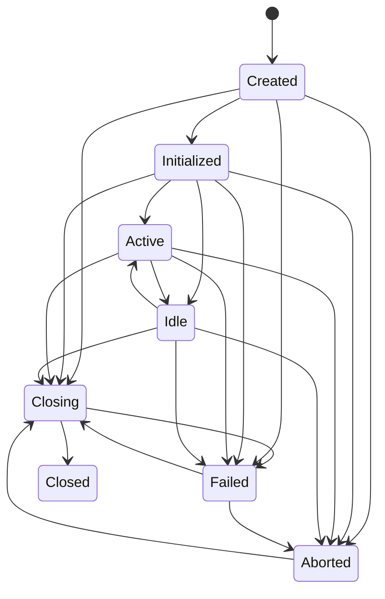

# Resource State Machine

## States

| State | Meaning |
| --- | --- |
| Created | Handle exists but is not initialized |
| Initialized | Resource initialization is complete |
| Active | Resource can be used |
| Idle | Resource remains initialized but inactive |
| Closing | Cleanup is in progress |
| Closed | Cleanup completed successfully |
| Failed | Operation or cleanup failed coherently |
| Aborted | Work was abandoned before normal completion |

## Transitions

Closed is terminal. Use is allowed only after initialization and outside
Closing, Closed, Failed, and Aborted. Unsupported transitions raise
`InvalidLifecycleTransitionError` and are audited.
